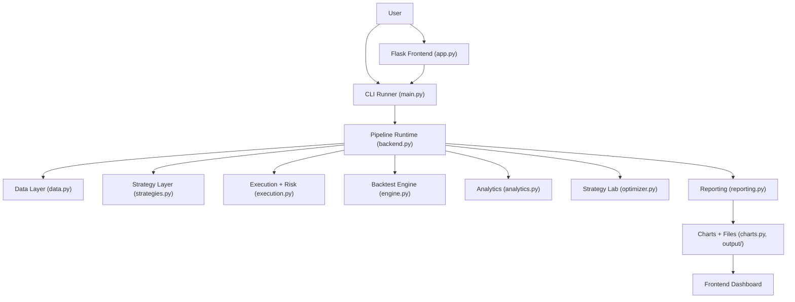
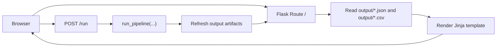

# Algorithmic Backtesting Engine

This project is a backend-first quantitative research system with a minimal Flask frontend layered on top of it. It can run rule-based backtests on synthetic data, CSV files, or Yahoo Finance data, then generate reports, rankings, audit artifacts, and a browser UI for viewing results, triggering new runs, or launching a train/test strategy lab.

## What This Project Does

At a high level, the system:

1. loads market data
2. validates and normalizes that data
3. runs multiple trading strategies through a backtesting engine
4. applies realistic cost and execution assumptions
5. computes performance, drawdown, walk-forward, Monte Carlo, and regime-resilience analytics
6. optionally runs a strategy lab that tunes parameter grids on a training split and validates promoted configurations on a holdout set
7. exports charts, CSV summaries, JSON and Markdown reports, and runtime audit files
8. serves those outputs through a minimal Flask frontend

The project is intentionally simple in deployment style:

- backend: plain Python modules
- frontend: Flask + server-rendered HTML
- charts: static PNG files generated by matplotlib
- reports: CSV, JSON, Markdown

## Core Capabilities

- Synthetic, CSV, and Yahoo Finance data ingestion
- Pluggable strategy library with signal-based entries and exits
- Realistic execution assumptions:
  - slippage
  - spread
  - brokerage and transaction costs
  - position sizing and risk constraints
- Strategy comparison with a composite resilience score
- Train/test strategy lab with parameter search and candidate promotion
- Walk-forward validation
- Monte Carlo bootstrap analysis
- Market regime classification and resilience scoring
- Run logging, strategy health auditing, and manifest output
- Minimal frontend with:
  - one-click demo backtest
  - one-click demo strategy lab
  - manual backtest form
  - live view of latest outputs

## Architecture Overview



## Runtime Flow

The normal execution path looks like this:

1. `main.py` receives CLI inputs such as source, symbol, capital, sizing method, and output directory.
2. `backend.py` validates the run configuration and creates isolated runtime config objects.
3. `data.py` loads and cleans OHLCV data.
4. If strategy lab mode is enabled, `optimizer.py` evaluates parameter grids on the training split and promotes one configuration per strategy family using holdout performance.
5. For each strategy:
   - `engine.py` simulates bar-by-bar trading
   - `execution.py` applies costs, slippage, and sizing rules
   - `analytics.py` computes performance metrics
   - `reporting.py` computes monthly consistency, walk-forward summaries, and regime-resilience details
   - `backend.py` records a strategy audit entry
6. `charts.py` writes visual outputs.
7. `reporting.py` exports JSON and Markdown reports.
8. `backend.py` writes `pipeline.log`, `strategy_health.csv`, and `run_manifest.json`.
9. `app.py` reads those outputs and renders the dashboard.

## Repository Structure

```text
.
├── app.py                 # Minimal Flask frontend
├── backend.py             # Runtime orchestration, validation, logging, manifests
├── main.py                # Main pipeline entry point
├── data.py                # Data ingestion and OHLCV validation
├── optimizer.py           # Train/test strategy lab and parameter search
├── strategies.py          # Strategy abstractions and signal generation
├── execution.py           # Slippage, cost model, position sizing
├── engine.py              # Backtesting engine and trade lifecycle
├── analytics.py           # Metrics, walk-forward, Monte Carlo
├── reporting.py           # Resilience ranking and report exports
├── charts.py              # Static chart generation
├── templates/
│   └── index.html         # Frontend page template
├── static/
│   └── styles.css         # Frontend styling
├── tests/
│   ├── test_backend.py    # Backend runtime tests
│   ├── test_frontend.py   # Frontend tests
│   ├── test_optimizer.py  # Strategy lab tests
│   └── test_smoke.py      # End-to-end smoke tests
├── requirements.txt
└── output/                # Generated run artifacts
```

## Module Responsibilities

### `main.py`

`main.py` is the main pipeline entry point. It:

- defines default strategy presets
- loads data based on CLI options
- optionally launches the strategy lab and promotes tuned configurations
- invokes the runtime backend
- triggers charts and report exports
- prints the terminal summary report

Use this when running from the command line.

### `backend.py`

`backend.py` is the operational backbone of the system. It adds production-style discipline to the otherwise simple Python pipeline.

Key responsibilities:

- validate user-provided run config
- create isolated runtime config copies
- evaluate strategies one by one
- prevent one strategy failure from crashing the whole run in normal mode
- write logs and manifests
- record per-strategy timing and health data

Important objects:

- `PipelineConfig`
- `StrategyAuditRecord`
- `evaluate_strategy(...)`
- `setup_run_logger(...)`
- `write_run_manifest(...)`

### `data.py`

The data layer handles all market data ingestion and cleaning.

Supported sources:

- `synthetic`
- `csv`
- `yfinance`

Important behavior:

- standardizes OHLCV column names
- validates required fields
- removes invalid rows
- ensures a `DatetimeIndex`
- creates a default `volume` column if missing

This means downstream modules can assume they are receiving a clean OHLCV frame.

### `strategies.py`

This module contains:

- the abstract `Strategy` base class
- a lightweight indicator library
- the concrete strategy implementations

Current strategies:

- MA Cross (EMA 10/30)
- MA Cross (EMA 20/50)
- Momentum (12-1)
- Mean Reversion (BB+Z)
- MACD+RSI
- Donchian Breakout (20/10)

Each strategy returns:

- `entries`: boolean series
- `exits`: boolean series

The engine expects those signals to be aligned with the input index.

### `optimizer.py`

This module powers the strategy lab.

Responsibilities:

- split the dataset into train and test segments
- evaluate candidate parameter grids for each strategy family
- score candidates on the training split
- promote one configuration per family
- summarize holdout performance for the promoted candidates

### `execution.py`

This module models realistic trade execution assumptions.

It includes:

- `CostConfig`
- `RiskConfig`
- `SlippageModel`
- `CostCalculator`
- `PositionSizer`
- `FillSimulator`

The cost model is tailored toward Indian equity-style assumptions, including brokerage, taxes, stamp duty, and GST.

### `engine.py`

This is the simulation engine.

Responsibilities:

- validates the backtest input frame
- normalizes strategy outputs
- iterates bar by bar without look-ahead
- opens and closes trades
- applies stop loss and optional take profit logic
- records trades and equity curve data

The engine currently simulates long-only positions, one symbol at a time, using signals computed from the input series.

### `analytics.py`

This module computes research metrics and robustness checks.

Included analytics:

- return metrics
- volatility and Sharpe/Sortino/Calmar/Omega
- drawdown and drawdown duration
- trade-level statistics
- alpha, beta, information ratio
- VaR, CVaR, skewness, kurtosis
- walk-forward validation
- Monte Carlo bootstrap simulation

### `reporting.py`

This module transforms raw results into decision-friendly outputs.

Responsibilities:

- monthly consistency summaries
- walk-forward rollups
- regime classification and resilience scoring
- composite strategy scorecard
- Markdown and JSON report export

This is the layer that makes the project feel like a research workflow, not just a backtest script.

### `charts.py`

This module generates static visual reports:

- best-strategy dashboard
- strategy comparison plot
- walk-forward plot
- Monte Carlo plot

These files are written to `output/` and displayed by the frontend.

### `app.py`

This is the minimal frontend.

It does not introduce a separate SPA or JavaScript build system. Instead, it:

- reads the generated output artifacts
- renders a server-side dashboard
- serves static PNG/CSV/JSON/Markdown files
- supports two run modes:
  - demo run
  - demo strategy lab
  - manual backtest form

This keeps the frontend small, maintainable, and easy to run locally.

## Frontend Architecture

The frontend follows a simple server-rendered pattern:



### Frontend Pages and Actions

There is currently one page:

- `/`

This page includes:

- run status card
- `Run Demo Backtest` button
- `Run Demo Strategy Lab` button
- `Manual Backtest` form
- summary cards for the best strategy
- strategy-lab split and promotion tables when optimization mode is used
- dataset and run-health panels
- resilience leaderboard
- visual output previews
- strategy health table
- downloadable artifacts

### Frontend Run Modes

#### Demo Mode

The demo action:

- uses synthetic data
- runs with default capital and sizing
- refreshes the dashboard outputs

This is the fastest way to try the project.

#### Manual Mode

The manual form accepts:

- source
- CSV file path
- ticker symbol
- start date
- end date
- capital
- sizing method
- strict mode
- strategy lab toggle
- train ratio

Behavior:

- `source=csv` uses the CSV path
- `source=yfinance` uses symbol and date range
- `source=synthetic` ignores symbol and file path

## Run Artifacts

The pipeline writes to `output/` by default.

Main artifacts:

- `strategy_lab.png`
- `strategy_lab.json`
- `strategy_lab_summary.csv`
- `strategy_lab_candidates.csv`
- `dashboard.png`
- `strategy_comparison.png`
- `walk_forward.png`
- `monte_carlo.png`
- `equity_curves.csv`
- `performance_summary.csv`
- `strategy_rankings.csv`
- `strategy_health.csv`
- `regime_summary.csv`
- `research_report.md`
- `research_report.json`
- `pipeline.log`
- `run_manifest.json`
- `trades_<strategy>.csv`

### Why The Audit Files Matter

The backend writes three especially important runtime artifacts:

- `pipeline.log`
  - chronological operational log
- `strategy_health.csv`
  - per-strategy success/failure, timing, and summary stats
- `run_manifest.json`
  - a structured snapshot of the run config, outputs, status, and failures

These make the project much easier to debug and trust.

## Installation

Create a virtual environment and install dependencies:

```bash
python3 -m venv .venv
source .venv/bin/activate
python3 -m pip install -r requirements.txt
```

## Running The Backend

### Default synthetic run

```bash
python3 main.py
```

### CSV run

```bash
python3 main.py --source csv --file /absolute/path/to/data.csv
```

### Yahoo Finance run

```bash
python3 main.py --source yfinance --symbol RELIANCE.NS --start 2021-01-01 --end 2024-01-01
```

### Custom capital and output folder

```bash
python3 main.py --capital 1500000 --output-dir ./output_run
```

### Strict mode

```bash
python3 main.py --strict
```

In strict mode, the pipeline stops on the first strategy failure. In normal mode, failed strategies are logged and the remaining strategies still run.

### Strategy lab mode

```bash
python3 main.py --source synthetic --optimize --train-ratio 0.70
```

This mode:

- tunes parameter grids on the training split
- promotes one configuration per strategy family
- exports holdout summaries and a dedicated strategy-lab chart
- runs the promoted strategies through the full reporting stack

## Running The Frontend

Start the Flask app:

```bash
python3 app.py
```

Then open:

[http://127.0.0.1:8000](http://127.0.0.1:8000)

If your backend outputs live somewhere else:

```bash
BACKTEST_OUTPUT_DIR=./output_run python3 app.py
```

If port `8000` is already in use, start the app with a small inline runner on another port:

```bash
python3 - <<'PY'
from app import create_app
app = create_app('output')
app.run(debug=False, host='127.0.0.1', port=8001)
PY
```

Then open:

[http://127.0.0.1:8001](http://127.0.0.1:8001)

## Testing

Run the full test suite:

```bash
python3 -m unittest discover -s tests -p 'test_*.py' -v
```

The tests cover:

- backend config validation
- strategy failure isolation
- engine smoke behavior
- strategy-lab candidate selection
- report generation behavior
- frontend rendering
- frontend run-form wiring

## Example End-To-End Usage

Typical local workflow:

1. activate the virtual environment
2. run a backtest with `main.py`
3. start `app.py`
4. review results in the browser
5. inspect `output/strategy_health.csv` and `output/run_manifest.json` if something looks wrong

Or, if you prefer the browser:

1. start `app.py`
2. open the dashboard
3. click `Run Demo Backtest`, `Run Demo Strategy Lab`, or submit the manual form
4. review the updated charts and downloads

## Extension Points

This project is designed to be easy to extend.

### Add a new strategy

1. implement a new class in `strategies.py`
2. return aligned `entries` and `exits`
3. add the strategy instance to `STRATEGIES` in `main.py`

### Change the execution assumptions

Edit:

- `CostConfig` in `execution.py`
- `RiskConfig` in `execution.py`
- sizing logic in `PositionSizer`
- fill logic in `FillSimulator`

### Add new analytics

The cleanest place is:

- `analytics.py` for raw metrics
- `reporting.py` for summaries, scorecards, or ranking logic

### Add more frontend pages

Start with:

- `app.py` for routes
- `templates/` for new views
- `static/styles.css` for styling

The current frontend is intentionally minimal, so adding a second page or a detail view is straightforward.

## Known Scope and Limitations

This project is solid for research and demonstration, but it is not a production trading platform.

Current limitations:

- long-only simulation
- single-asset backtest engine
- no live brokerage integration
- no persistent database
- no asynchronous job queue
- frontend runs backtests in-process
- chart outputs are static images, not live interactive charts

These were deliberate tradeoffs to keep the project understandable and easy to run locally.

## Troubleshooting

### Frontend shows no options

The input form only appears in the Flask frontend, not in the generated PNG files. Open the browser app, not the chart files directly.

### `Address already in use`

Port `8000` is occupied. Start the frontend on another port, such as `8001`.

### CSV run fails immediately

Make sure:

- the CSV path is absolute or correct relative to the project folder
- the file includes OHLC columns
- a date column can be parsed

### One strategy fails

Check:

- `output/pipeline.log`
- `output/strategy_health.csv`
- `output/run_manifest.json`

These files will tell you whether the failure was isolated or fatal.

## Summary

This repository combines:

- a clean Python backtesting backend
- realistic execution and cost assumptions
- a research-focused reporting layer
- runtime auditability
- a minimal but practical frontend

It is small enough to understand quickly, but structured enough to grow into a stronger research tool.
